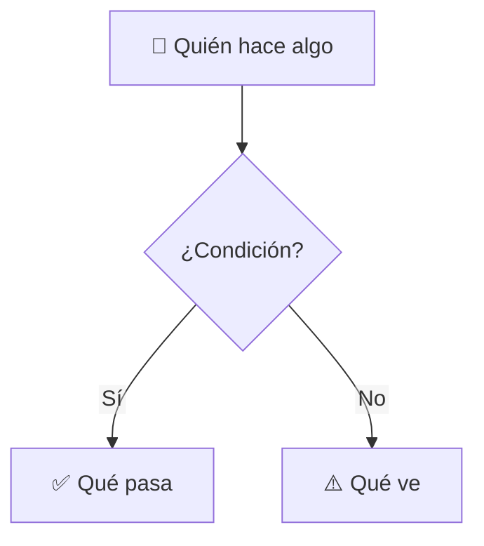

<!-- El chequeo del PR exige `Closes #N` con un ticket que tenga escenario BDD (los PRs `docs(...)` están exentos). -->
Closes #

## En simple

<!-- Para el dueño, que lo lee desde el celular: sin términos técnicos. Ejemplo: vitrina#36. -->

**Qué cambia para el usuario:** <!-- 1 a 3 frases: quién puede hacer qué, ahora. -->

<!-- Diagrama solo si hay un flujo (pasos o decisiones). Usa siempre este formato: la primera línea (htmlLabels y wrappingWidth) evita que GitHub corte el texto; de arriba hacia abajo se lee bien en el celular. -->

**Cómo probarlo** en el [preview](https://pr-N--vitrina-jjhoncv.netlify.app):
1. <!-- Pasos concretos, con lo que debe ver en cada uno. -->

**Qué necesito de ti**
- [ ] <!-- Cuentas, permisos, datos de prueba… o «Nada». -->

**Escenarios en verde:** <!-- los de este ticket --> · **Proyecto: X de Y.**

---

<strong>Detalle técnico</strong> (para revisar el código)

**Archivos**
| Archivo | Qué hace |
|---|---|
| | |

**Decisiones:** <!-- las que no son obvias leyendo el código; ADR si aplica. -->

**Verificación:** `npm run lint && npm run typecheck && npm test && npm run build && npm run e2e`

**Fuera de este PR:** <!-- lo que quedó pendiente o va al Parking lot. -->

- [ ] Apunta a un escenario del alcance (`PROYECTO.md`)
- [ ] Pruebas escritas primero y en verde
- [ ] Menos de 300 líneas
- [ ] Sin secretos en el código

